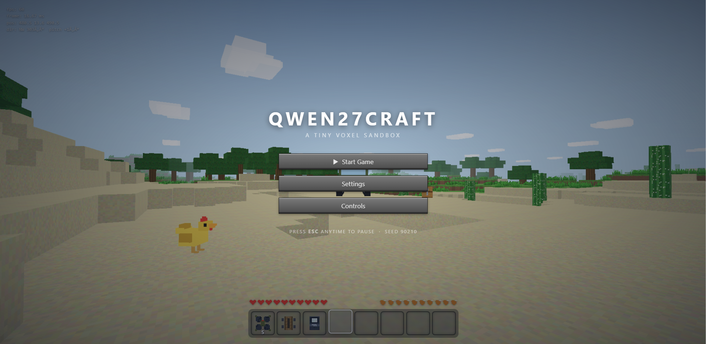

# Qwen27craft 🪏



<a href="https://kamjin3086.github.io/qwen27craft/"></a> [View on GitHub](https://github.com/kamjin3086/qwen27craft)

A tiny Minecraft-style voxel sandbox that runs entirely in your web browser, built with [three.js](https://threejs.org/). The whole game — procedural terrain, block building/breaking, survival systems, creatures, and a handful of wild extras — was generated by **Qwen3 (27B)**.

> Some people said the Minecraft clone I fully made myself in three.js would never work. Here it is anyway.
>
> https://www.reddit.com/r/LocalLLaMA/comments/1w2cxcw/some_people_said_the_minecraft_clone_i_fully/

## Features

- **Procedural voxel world** — a 960 × 960 block map with grass, dirt, stone, sand, water, trees, and tall grass.
- **First-person movement** — walk, run, jump, swim, and dive with full mouse-look (pointer lock).
- **Building & breaking** — hold to break blocks (with crack progress + particles), place from your hand, and pick items across an inventory grid with drag-and-drop.
- **Survival vitals** — health hearts, hunger bar, and an oxygen meter when submerged.
- **Creatures** — passive mobs that drop meat when hit; cacti hurt on contact.
- **Easter eggs & specials**:
  - 🛹 **Skateboard** — ride it, ollie, and do mid-air tricks (roll/pitch); break it back into your hand after enough crashes.
  - 🚀 **MLRS truck** — climb into the cockpit for a top-down aerial targeting view; arm and fire a 12-rocket salvo at a bullseye.
  - 🛸 **FPV drone** — a betaflight-style cockpit OSD with attitude ladder, altitude/speed/throttle readouts.
  - 💻 **Computer** — sit down to use a little desktop OS with two mini-apps: *Pelican Bench* (an animated SVG) and *Terrainria* (a tiny Terraria-ish side-scroller).

## Getting Started

The game is pure static files, so you just need any local web server.

```bash
python -m http.server 8000
```

Then open your browser:

```
http://localhost:8000
```

Click **Start Game** and click the screen to lock your mouse and begin playing.

## Controls

| Action | Key |
| --- | --- |
| Move / swim | `W` `A` `S` `D` |
| Look around | Mouse |
| Jump / float up (in water) | `Space` |
| Sprint / dive | `Shift` |
| Break block (hold) | Left Mouse Button |
| Place from hand (hold) | Right Mouse Button |
| Select hotbar slot | `1`–`8` / Mouse Wheel |
| Inventory | `Tab` / `Esc` (drag items between slots; RMB grabs half) |
| Drop item | `Q` / `Shift+Q` |
| Eat meat (with it selected) | Hold Right Mouse Button |
| Pause / release mouse | `Esc` |

Full details for the skateboard, MLRS truck, drone, and computer are available in the in-game **Controls** menu.

## Files

| File | Purpose |
| --- | --- |
| `index.html` | Page layout, UI/HUD overlays, and the pause menu |
| `game.js` | Core game engine: world generation, rendering, physics, input, and systems |
| `sounds.js` | Live-generated sound effects (no audio files needed) |

## Settings

The **Settings** menu adjusts video (draw distance, FOV, particles), mouse (sensitivity, invert Y), sound volume, and the debug readout. Changes apply instantly and are saved to `localStorage`.

## Credits

- Engine & rendering: [three.js](https://threejs.org/)
- Generated with **Qwen3 (27B)**
- Original concept/discussion: [Reddit r/LocalLLaMA](https://www.reddit.com/r/LocalLLaMA/comments/1w2cxcw/some_people_said_the_minecraft_clone_i_fully/)
